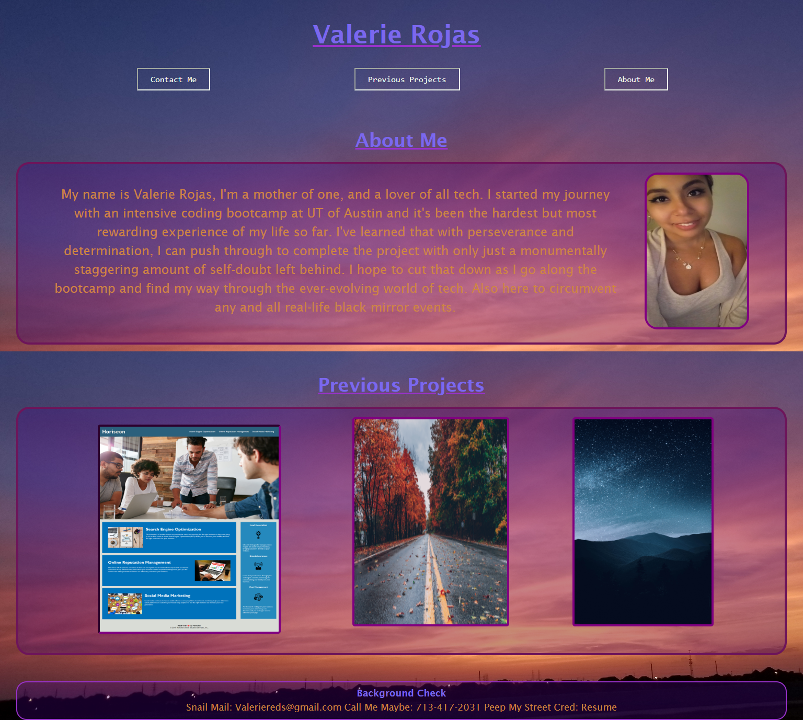

# professional-portfolio

## Description

This is my amateur's attempt at implementing and show-casing what coding know-how I've learned so far. I started this portfolio barely understanding CSS styling and all the different ways to layout and format a webpage. But through this endeavor, I've come to learn that there's multiple ways to find a solution to any one problem. I've learned that button animations and opaque text boxes are more difficult than first perceived. Keep moving forward, always retrace your steps, never give up, and above all else, commit all changes to your main github repository every hour. 

## Usage

https://valeriereds.github.io/professional-portfolio/

## License

MIT License

Copyright (c) [2023] [ValerieRojas]

Permission is hereby granted, free of charge, to any person obtaining a copy
of this software and associated documentation files (the "Software"), to deal
in the Software without restriction, including without limitation the rights
to use, copy, modify, merge, publish, distribute, sublicense, and/or sell
copies of the Software, and to permit persons to whom the Software is
furnished to do so, subject to the following conditions:

The above copyright notice and this permission notice shall be included in all
copies or substantial portions of the Software.

THE SOFTWARE IS PROVIDED "AS IS", WITHOUT WARRANTY OF ANY KIND, EXPRESS OR
IMPLIED, INCLUDING BUT NOT LIMITED TO THE WARRANTIES OF MERCHANTABILITY,
FITNESS FOR A PARTICULAR PURPOSE AND NONINFRINGEMENT. IN NO EVENT SHALL THE
AUTHORS OR COPYRIGHT HOLDERS BE LIABLE FOR ANY CLAIM, DAMAGES OR OTHER
LIABILITY, WHETHER IN AN ACTION OF CONTRACT, TORT OR OTHERWISE, ARISING FROM,
OUT OF OR IN CONNECTION WITH THE SOFTWARE OR THE USE OR OTHER DEALINGS IN THE
SOFTWARE.